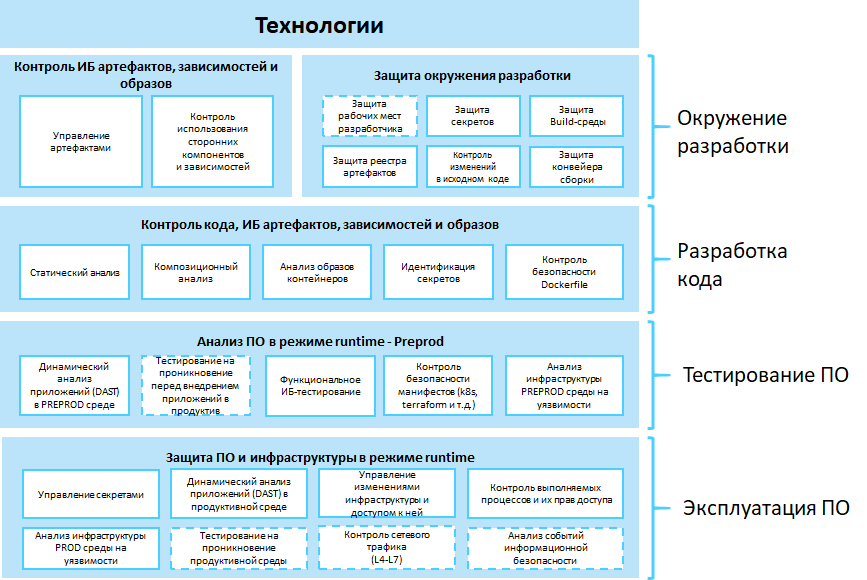
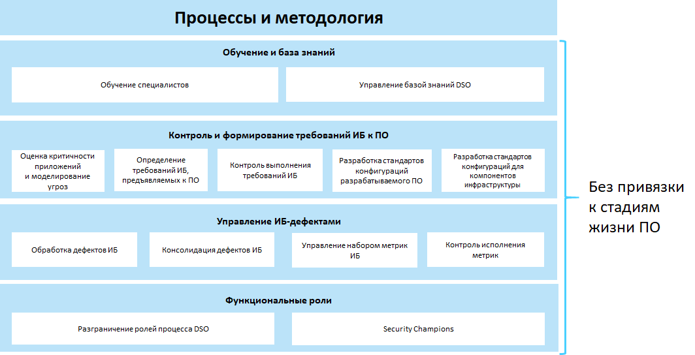
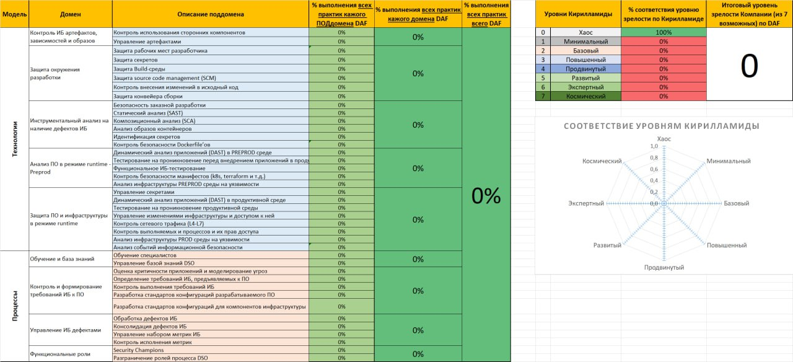
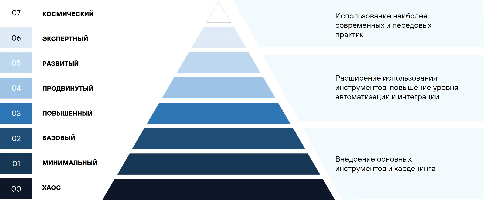

# DevSecOps Assessment Framework (DAF)

### Cодержание

- [Введение](#введение)
    - [Важный дисклеймер](#важный-дисклеймер)
- [Цели и задачи DAF](#цели-и-задачи-daf)
- [Описание DAF](#описание-daf)
    - [Карта DAF (ex - *Пиратская карта*)](#карта-daf)
        - [Модель Технологии](#модель-технологии)
        - [Модель Процессы](#модель-процессы)
    - [Маппинг со стандартами и Тепловая матрица](#маппинг-со-стандартами-и-тепловая-матрица)
        - [Маппинг со стандартами](#маппинг-со-стандартами)
        - [Тепловая матрица (Heatmap)](#тепловая-матрица-heatmap)
    - [Пирамида зрелости (ex - *Кирилламида*)](#пирамида-зрелости)
- [Как пользоваться фреймворком](#как-пользоваться-фреймворком)
- [Материалы, используемые при создании](#материалы-используемые-при-создании)
- [Связаться с нами](#связаться-с-нами)

## Введение

Есть множество полезных фреймворков, позволяющих оценить процессы безопасной разработки, например, SAMM, BSIMM, DSOMM, MSDL. Также есть лучшие практики, бенчмарки, рекомендуемые подходы к защите контейнеров и сред контейнерной оркестрации, такие как NSA Kubernetes Hardening Guide, или, например CIS for Kubernetes. Помимо этого, существует множество инструментов, повышающих защищенность при формировании и совершенствовании процессов DevSecOps (SAST, DAST, SCA, Container security, Secret management и другие) со своими рекомендациями по настройкам и их использованию. Но нет чего-то одного, описывающего, что конкретно и в какой последовательности нужно делать, чтобы выстроить процесс безопасной разработки, а также чтобы объективно оценить существующий уровень зрелости безопасной разработки и понять, куда двигаться дальше.

Эту проблему призван решить DevSecOps Assessment Framework (DAF). Он включает в себя не просто набор рекомендаций и лучших подходов из разных областей DevSecOps, но еще и большой экспертный опыт нашего сообщества, структурированный и адаптированный под современные реалии. Некоторые практики из общеизвестных фреймворков не добавлены в DAF, но при этом сформированы новые и более детальные. Все модели, домены, поддомены и практики описаны понятным языком во избежание двусмысленностей и разных толкований.

### Важный дисклеймер

В открытый доступ выложены не все наши наработки по DAF. Но мы считаем, что основная часть фреймворка DAF все же должна быть публичным достоянием, а именно:

- Карта DAF (ex - *Пиратская карта*);
    - Модели *Технологии* и *Процессы*, включенные в них домены, поддомены и практики, а также маппинг этих практик на другие широкоизвестные фреймворки (BSIMM, SAMM, DSOM и пр.);
- Маппинг со стандартами и Тепловая матрица зрелости;
- Пирамида зрелости (ex - *Кирилламида*).

**Все это навсегда останется общедоступным.**

Однако, есть и “закрытая” часть, которую мы реализуем в наших проектах по аудиту с использованием DAF. В ней есть:

- Опросные листы для команд разработки для более удобного сбора информации от них “оффлайн”;
- Супердетальные примеры того, “как проверить, что та или иная практика ДЕЙСТВИТЕЛЬНО выполняется”, а также примеры того, как необходимо реализовывать КАЖДУЮ практику;
- RoadMap (дорожная карта развития) построения процессов DevSecOps на основе каждой практики и ее реализации из пункта выше;
- Динамическая “иллюминация” - подсветка каждой ячейки Пирамиды зрелости (Кирилламиды), тепловой карты и Карты DAF (Пиратской карты), в зависимости от степени выполнения практик;
- Детальный и кастомизируемый отчет по аудиту на основе DAF;
- Автоматизированный расчет FTE специалистов DevSecOps \ AppSec для внедряемых инструментов DevSecOps с учетом количества команд разработки и планируемых задач;
- и многое другое.

## Цели и задачи DAF

При внедрении практик и процесса безопасной разработки ПО первый и самый главный вопрос, с которым сталкиваются компании — **«С чего начать?»**. Для того, чтобы ответить на этот вопрос, нужно преодолеть следующий путь:

1. Определить, где вы находитесь сейчас;
2. Определить, в какую сторону хотите развиваться;
3. Зафиксировать целевое состояние;
4. Определить инициативы, реализация которых поможет достичь целевого состояния;
5. Проанализировать всю собранную информацию для оценки необходимых ресурсов;
6. Сформировать дорожную карту реализации инициатив;
7. Реализовать инициативы.

Основные задачи, которые ставились при создании DAF:

- сформировать набор практик, который будет охватывать весь процесс безопасной разработки с детализацией;
- сформировать набор практик, которые будут действительно актуальны;
- сделать максимально простой процесс оценки зрелости;
- сформировать подход к определению текущего уровня зрелости организации и практик, которые к этому уровню относятся;
- сформировать понятную визуализацию для удобства восприятия результатов;
- сформировать инкрементальный подход к уровням зрелости.

## Описание DAF

DevSecOps Assessment Framework — это фреймворк оценки зрелости процесса безопасной разработки ПО. В данном случае под словом фреймворк мы понимаем набор инструментов, принципов, правил, руководств и процессов, которые помогают создавать безопасное ПО.

**DAF состоит из трех компонентов:**

- Карта DAF (ex - *Пиратская карта*);
- Маппинг со стандартами и Тепловая матрица;
- Пирамида зрелости (ex - *Кирилламида*).

### Карта DAF

> (ex - *Пиратская карта*) 

*Карта DAF* — это верхнеуровневый взгляд на весь фреймворк. Она включает в себя все аспекты процесса безопасной разработки с этапа планирования до перевода ПО в промышленную эксплуатацию. Карта делится на два блока: модель *Технологии* и *Процессы*.

#### Модель *Технологии*

#### Модель *Процессы*

### Маппинг со стандартами и Тепловая матрица

#### Маппинг со стандартами

Маппинг со стандартами содержит различные практики, а также критерии оценки (”Верно” и “Неверно” для нулевого этапа, а также “Выполняется”, “Частично выполняется” и “Не выполняется” для практик 1го и последующих этапов зрелости). В маппинге практики сгруппированы в поддомены, а поддомены - в домены. Для соответствия  конкретному этапу зрелости может потребоваться выполнение одной или нескольких практик.

[Маппинг со стандартами в формате markdown (v4.6.4)](DAF.md)

#### Тепловая матрица (Heatmap)

Тепловая матрица показывает степень выполнения практик в рамках определенного поддомена в соответствии с четырьмя этапами зрелости каждой практики (в процентах). Например, если для соответствия ТРЕТЬЕМУ этапу “Идентификация секретов” требуется соблюдение 4х условий, но на момент аудита выполняется только 2 условия, то в матрице отобразится значение “50%” соответствия третьему этапу.

Основная цель тепловой матрицы — **визуализация полученных данных.**

В Таблице оценки и Тепловой матрице существуют следующие этапы зрелости (по аналогии с большинством других общеизвестных фреймворков):

- **Этап 0: Uninitiated**

    > На этом этапе компания не имеет никаких формализованных процессов или инструментов безопасной разработки. Практики могут использоваться случайным образом по инициативе отдельных работников.

- **Этап 1: Beginners**

    > На этом этапе зрелости практик в компании начинают появляются инструменты, используемые при безопасной разработке с минимальной зоной покрытия и без автоматизации. Появляются базовые процессы.

- **Этап 2: Intermediate**

    > Процессы на этом этапе становятся повторяемыми и управляемыми, происходит расширение зоны покрытия используемых инструментов, внедрение автоматизации. Компания начинает применять методики для планирования, выполнения и отслеживания активностей. Однако эти методики могут быть не всегда последовательными или не полностью документированными. Инструменты по прежнему не покрывают весь процесс безопасной разработки.
 
- **Этап 3: Advanced**

    > На данном этапе фактически инструменты безопасной разработки обеспечивают максимальное покрытие и автоматизацию. Все процессы являются последовательными и полностью документированными
 
- **Этап 4: Experts**

    > Когда все процессы и инструменты развиты максимально, нет предела совершенству. Можно по прежнему что-то улучшить и повысить зрелость.

### Пирамида зрелости

> (ex - *Кирилламида*) 

Понятие родилось из слияния слова *Пирамида* и имени ее основателя — ***Кирилла Бочкарева***. Только теперь она перестала быть пирамидой в угоду удобства навигации, но понятие надежно закрепилось за этой частью DAF.

Пирамида зрелости нужна для отображения последовательности внедрения практик безопасной разработки с максимальной детализацией всех активностей. 

**Зачем она нужна:**

- **Понять текущее положение дел в рамках всего процесса безопасной разработки**: Компания может определить на каком уровне зрелости находится в данный момент.
- **Планировать**: Пирамида зрелости позволяет планировать следующие шаги в развитии процессов безопасной разработки.
- **Мотивировать**: Отслеживая прогресс в Пирамиде зрелости, команды разработки могут видеть свое развитие, что может служить мотивацией для дальнейших улучшений.
- **Стандартизировать**: Пирамида зрелости может служить основой для внутренних стандартов и правил, устанавливаемых компанией, для повышения качества процессов безопасной разработки.

**Выбор целевого уровня** Пирамиды зрелости происходит по следующему алгоритму:

1. По умолчанию целевой уровень – «Базовый», включающий в себя внедрение базовых инструментов и процессов, а также их необходимую на начальном этапе область действия.
2. В случае если практики безопасной разработки ПО на **каждом** из уровней 0-2 выполняются на 80-100%, то необходимо выбрать целевой уровень «Повышенный» или «Продвинутый».
3. В случае если практики безопасной разработки ПО на каждом из уровней 0-2 выполняются на 80-100%, а практики уровней 3-5 выполняются менее чем на 80% на **любом** из уровней, целевым стоит выбрать уровень «Развитый».
4. В случае если практики безопасной разработки ПО на **каждом** из уровней 0-5 выполняются не менее чем на 80%, целевым уровнем может являться «Экспертный» или «Космический».

> Практики, расположенные на более низких уровнях Пирамиды зрелости, имеют более высокий приоритет реализации по сравнению с практиками, расположенными на более высоких уровнях.

## Как пользоваться фреймворком

Краткий гайд:

1. Самый правильный путь — открыть вкладку “Маппинг со стандартами”, в которой собраны все домены, поддомены и практики и заполнять последовательно все практики сверху вниз. Можно сгруппировать все строки по поддоменам (группа строк “2” в левом верхем углу листа excel) и, если какой-то поддомен вообще не реализуется у вас в компании, то можно просто пропустить его и не заполнять (оставить “Неверно” в нулевом уровне и по всем практикам этого поддомена оставить “Не выполняется”)
2. Для “распараллеливания” процесса заполнения всех практик их можно отдавать отдельно целыми поддоменами в соответствующие структурные подразделения вашей компании для выставления ответов.
3. После заполнения всех практик на листе “Маппинг со стандартами” можно оценить на этом же листе в каком процентном соотношении закрывается тот или иной поддомен у вас в компании. На вкладке “Heatmap” (Тепловая матрица) будет также видно это процентное соотношение, но еще и с “динамической иллюминацией” (автоматизированным раскрашиванием ячеек поддоменов в зависимости от указанных вами ответов на листе “Маппинг со стандартами”)
4. Листы “Кирилламида” (Пирамида зрелости) и “Карта DAF” в публичной версии не имеют “динамической иллюминации”, но 
    1. Карта DAF позволяет верхнеуровнево представить наполнение моделей доменами, а доменов поддоменами с практиками. Такая визуализация неплохо подходит для отчета по проведенному аудиту
    2. Пирамида зрелости позволит оценить насколько зрелыми являются процессы безопасной разработки у вас в компании. Для более наглядной визуализации можно, например, раскрасить самостоятельно ячейки с группами практик (например, T-CODE-IMG-1, T-PREPROD-DAST-2 и все остальные в соответствующие цвета в зависимости от процента выполнения каждой из этих групп практик на вкладке “Heatmap”) и\или посчитать средний процент выполнения каждой группы практик на всех уровнях зрелости Кирилламиды. А затем определить текущий уровень зрелости и определить целевой уровень согласно методики из описания DAF.
5. Раскрашенная Пирамида зрелости также неплохо подойдет для отчета об аудите процессов безопасной разработки.

Если у вас есть свои мысли или идеи что нужно поправить, как лучше пользоваться фреймворком - обязательно пишите нам, мы постараемся всё учесть!

## Материалы, используемые при создании

Для создания фреймворка были проанализированы и использованы следующие материалы:

- Международные лучшие практики:
    - [Building Security In Maturity Model (BSIMM)](https://www.synopsys.com/software-integrity/software-security-services/bsimm-maturity-model.html);
    - [OWASP Software Assurance Maturity Model (SAMM)](https://owasp.org/www-project-samm/);
    - [DevSecOps Maturity Model (DSOMM)](https://dsomm.owasp.org/);
    - [Microsoft Security Development Lifecycle (SDL)](https://www.microsoft.com/en-us/securityengineering/sdl);
    - [ГОСТ Р 58412-2019. РАЗРАБОТКА БЕЗОПАСНОГО ПРОГРАММНОГО ОБЕСПЕЧЕНИЯ. Угрозы безопасности информации при разработке программного обеспечения](https://docs.cntd.ru/document/1200164529);
    - [A Model For Measuring Improvement Of Security In Continuous Integration pipelines](http://essay.utwente.nl/88916/1/Akujobi_EEMCS_faculty%20%28002%29.pdf);
    - [Open Source Software (OSS) Secure Supply Chain (SSC) Framework Simplified Requirements](https://github.com/microsoft/oss-ssc-framework/blob/main/specification/framework.md).
- Практики от Center for Internet Security (CIS):
    - [CIS Software Supply Chain Security Guide](https://www.cisecurity.org/insights/white-papers/cis-software-supply-chain-security-guide);
    - [CIS GitHub Benchmark](https://www.cisecurity.org/insights/blog/cis-benchmarks-february-2023-update).
- Best practices:
    - Aqua Cloud Native Security Maturity Model;
    - [Secrets Management Maturity Model](https://blog.gitguardian.com/a-maturity-model-for-secrets-management/).
- Наш опыт, а также опыт наших заказчиков.

## Связаться с нами

И еще небольшая просьба: если вы используете наш фреймворк в коммерческих целях, в разработке локальных или государственных нормативных актов, в маркетинговых или иных публичных целях, если рассказываете об этом фреймворке в статьях или на конференциях — сообщайте, пожалуйста, нам (например, в чат или просто в почту). 

- [Telegram: DevSecOps_Assessment_Framework](https://t.me/DevSecOps_Assessment_Framework)
- [Mail: daf@jet.su](mailto:daf@jet.su)

Эта информация нам крайне пригодится для понимания охвата и полезности нашего фреймворка.
