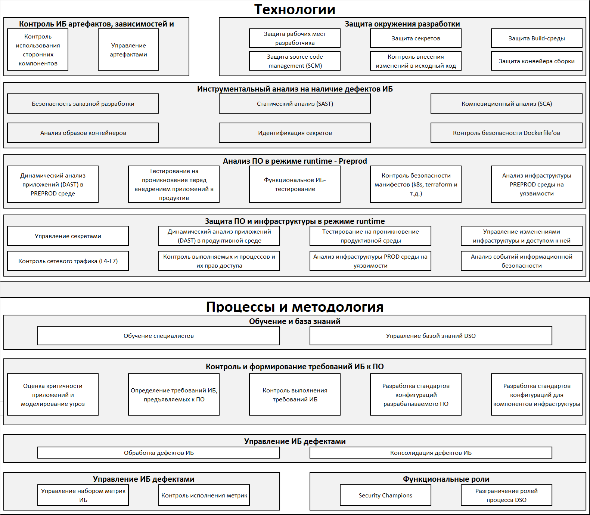

# DevSecOps Assessment Framework (DAF)

### Cодержание

- [Введение](#введение)
    - [Важный дисклеймер](#важный-дисклеймер)
- [Цели и задачи DAF](#цели-и-задачи-daf)
- [Описание DAF](#описание-daf)
    - [Карта DAF (ex - *Пиратская карта*)](#карта-daf)
        - [Модель Технологии](#модель-технологии)
        - [Модель Процессы](#модель-процессы)
    - [Практики](#практики)
    - [Результаты аудита](#результаты-аудита)
    - [Кирилламида (Пирамида зрелости)](#кирилламида)
- [Как пользоваться фреймворком](#как-пользоваться-фреймворком)
- [Материалы, используемые при создании](#материалы-используемые-при-создании)
- [Связаться с нами](#связаться-с-нами)

## Введение

Есть множество полезных фреймворков, позволяющих оценить процессы безопасной разработки, например, SAMM, BSIMM, DSOMM, MSDL. Также есть лучшие практики, бенчмарки, рекомендуемые подходы к защите контейнеров и сред контейнерной оркестрации, такие как NSA Kubernetes Hardening Guide, или, например CIS for Kubernetes. Помимо этого, существует множество инструментов, повышающих защищенность при формировании и совершенствовании процессов DevSecOps (SAST, DAST, SCA, Container security, Secret management и другие) со своими рекомендациями по настройкам и их использованию. Но нет чего-то одного, описывающего, что конкретно и в какой последовательности нужно делать, чтобы выстроить процесс безопасной разработки, а также чтобы объективно оценить существующий уровень зрелости безопасной разработки и понять, куда двигаться дальше.

Эту проблему призван решить DevSecOps Assessment Framework (DAF). Он включает в себя не просто набор рекомендаций и лучших подходов из разных областей DevSecOps, но еще и большой экспертный опыт нашего сообщества, структурированный и адаптированный под современные реалии. Некоторые практики из общеизвестных фреймворков не добавлены в DAF, но при этом сформированы новые и более детальные. Все модели, домены, поддомены и практики описаны понятным языком во избежание двусмысленностей и разных толкований.

### Важный дисклеймер

В открытый доступ выложены НЕ ВСЕ наши наработки по DAF. Но мы считаем, что основная часть фреймворка DAF все же должна быть публичным достоянием, а именно вкладки:

- "_Общее, домены, поддомены_", содержащая сводную информацию о подходах DevSecOps и декомпозиции DAF;
- "_Результаты аудита_" с оценкой по аудиту; 
- "_Практики_", содержащая **_ВСЕ_** практики DAF (мы ничего не "обрезаем" в публичной версии) и их маппинг на другие широкоизвестные фреймворки (BSIMM, SAMM, DSOM и пр.);
- "_Кирилламида_" (Пирамида зрелости), содержащая разбиение групп практик по уровням зрелости DAF;
- "_Карта DAF_" (ex - *Пиратская карта*) с визуализацией всех доменов и поддоменов DAF;
- "_miniRoadmap_", содержащая верхнеуровневый взгляд на последовательность выполнения поддоменов DAF;
- "_Документы для процессов DSO_" с предполагаемыми документами и их содержанием, необходимыми для выполнение требований DAF и ГОСТ 56939-2024;
- "_FTE DevSecOps_" и "_FTE AppSec_" - калькуляторы для расчета FTE DevSecOps и AppSec инженеров для компании;
- "_***_mapping_" - автомаппинги DAF на другие стандарты и фреймворки ("подтягиваются" данные из вкладки "Практики" но в раскладке других фреймворков).

**Все это навсегда останется общедоступным.**

Однако, есть и “закрытая” часть, которую мы реализуем в наших проектах по аудиту с использованием DAF. В ней есть:

- Детальные опросные листы и примеры запрашиваемой информации для команд разработки для более удобного сбора информации от них “оффлайн”;
- Детальные примеры того, “как проверить, что та или иная практика ДЕЙСТВИТЕЛЬНО выполняется”, а также примеры того, как необходимо реализовывать КАЖДУЮ практику (уникальная база знаний по выполнению каждой практики);
- Детальный RoadMap (дорожная карта развития) построения процессов DevSecOps на основе каждой практики и ее реализации из пункта выше;
- Автоматизация сбора информации и составления результирующего отчета;
- Шаблон детального отчета аудита по DAF;
- Описание ролей в командах разработки, DevSecOps и AppSec, схемы бизнес-процессов безопасной разработки, матрицу компетенций участинков процесса безопасной разработки;
- и многое другое.

## Цели и задачи DAF

При внедрении практик и процесса безопасной разработки ПО первый и самый главный вопрос, с которым сталкиваются компании — **«С чего начать?»**. Для того, чтобы ответить на этот вопрос, нужно преодолеть следующий путь:

1. Определить, где вы находитесь сейчас;
2. Определить, в какую сторону хотите развиваться;
3. Зафиксировать целевое состояние;
4. Определить инициативы, реализация которых поможет достичь целевого состояния;
5. Проанализировать всю собранную информацию для оценки необходимых ресурсов;
6. Сформировать дорожную карту реализации инициатив;
7. Реализовать инициативы.

## Описание DAF

DevSecOps Assessment Framework — это фреймворк оценки зрелости процесса безопасной разработки ПО (под словом "_фреймворк_" мы понимаем набор инструментов, принципов, правил, руководств и процессов).

**DAF состоит из трех основных компонентов:**

- Карта DAF (ex - *Пиратская карта*);
- Практики;
- Результаты аудита;
- Кирилламида.

### Карта DAF

> (ex - *Пиратская карта*) 

*Карта DAF* — это верхнеуровневый взгляд на весь фреймворк. Она включает в себя все аспекты процесса безопасной разработки с этапа планирования ПО до его перевода в промышленную эксплуатацию. Карта делится на два блока: модель *Технологии* и *Процессы*.

### Практики

Этот раздел содержит различные практики, а также критерии оценки (”Верно” и “Неверно” для нулевого уровня, а также “Выполняется”, “Частично выполняется”, “Не выполняется” и "Не применимо" для практик 1го и последующих уровней зрелости). Практики сгруппированы в поддомены, а поддомены - в домены. Для соответствия  конкретному уровню зрелости может потребоваться выполнение одной или нескольких практик.

[Практики в формате markdown (v4.6.4)](DAF.md)

### Результаты аудита

На вкладке "Результаты аудита" собрана информация о степени выполнения практик (некоторые столбцы скрыты, но если их раскрыть - будет видна детальная информация о выполнении практик, сгруппированных по _**сложности**_ каждой практики (в процентах). Например, если для соответствия ТРЕТЬЕМУ уровню сложности “Идентификация секретов” требуется соблюдение 4х условий, но на момент аудита выполняется только 2 условия, то в таблице отобразится значение “50%” соответствия третьему уровню сложности).

### Кирилламида

> Понятие родилось из слияния слова *Пирамида* и имени ее основателя — ***Кирилла Бочкарёва***. Только теперь она перестала быть **_пирамидой_** в угоду удобства навигации, но понятие надежно закрепилось за этой частью DAF.

Основное предназначение Кирилламиды — отображение последовательности внедрения практик безопасной разработки с максимальной детализацией всех активностей. 

**Зачем она нужна:**

- **Понять текущее положение дел в рамках всего процесса безопасной разработки**: Компания может определить на каком уровне зрелости находится в данный момент.
- **Планировать**: Кирилламида позволяет планировать следующие шаги в развитии процессов безопасной разработки.
- **Мотивировать**: Отслеживая прогресс в Кирилламиде, команды разработки могут видеть свое развитие, что может служить мотивацией для дальнейших улучшений.
- **Стандартизировать**: Кирилламида может служить основой для внутренних стандартов и правил, устанавливаемых компанией, для повышения качества процессов безопасной разработки.

**Выбор целевого уровня** Кирилламиды происходит по следующему алгоритму:

1. По умолчанию целевой уровень – «Базовый», включающий в себя внедрение базовых инструментов и процессов, а также их необходимую на начальном этапе область действия.
2. В случае если практики безопасной разработки ПО на **каждом** из уровней 0-2 выполняются на 80-100%, то необходимо выбрать целевой уровень «Повышенный» или «Продвинутый».
3. В случае если практики безопасной разработки ПО на **каждом** из уровней 0-2 выполняются на 80-100%, а практики уровней 3-5 выполняются менее чем на 80% на **любом** из уровней, целевым стоит выбрать уровень «Развитый».
4. В случае если практики безопасной разработки ПО на **каждом** из уровней 0-5 выполняются не менее чем на 80%, целевым уровнем может являться «Экспертный» или «Космический».

> Практики, расположенные на более низких уровнях Кирилламиды, имеют более высокий приоритет реализации по сравнению с практиками, расположенными на более высоких уровнях.

## Как пользоваться фреймворком

Краткий гайд:

1. Самый простой путь — открыть вкладку “**Практики**” и практики и заполнять последовательно все практики сверху вниз. Можно сгруппировать все строки по поддоменам (группа строк “2” в левом верхем углу листа excel) и, если какой-то поддомен вообще не реализуется у вас в компании, то можно просто пропустить его и не заполнять (оставить “Неверно” в нулевом уровне и по всем практикам этого поддомена оставить “Не выполняется”);
2. Для “распараллеливания” процесса заполнения всех практик их можно отдавать отдельно целыми поддоменами в соответствующие структурные подразделения вашей компании для выставления ответов;
3. После заполнения всех практик на листе “Практики” можно оценить на этом же листе в каком процентном соотношении закрывается тот или иной поддомен у вас в компании;
4. Листы “Кирилламида” и “Карта DAF” в публичной версии не имеют “динамической иллюминации”, но 
    - Карта DAF позволяет верхнеуровнево представить наполнение моделей доменами, а доменов поддоменами с практиками. Такая визуализация неплохо подходит для отчета по проведенному аудиту
    - Кирилламида позволит оценить насколько зрелыми являются процессы безопасной разработки у вас в компании. Для более наглядной визуализации можно, например, раскрасить самостоятельно ячейки с группами практик (например, T-CODE-IMG-1, T-PREPROD-DAST-2 и все остальные в соответствующие цвета в зависимости от процента выполнения каждой из этих групп практик на вкладке “Результаты аудита”) и\или посчитать средний процент выполнения каждой группы практик на всех уровнях зрелости Кирилламиды. А затем определить текущий уровень зрелости и определить целевой уровень согласно методики из описания DAF.
5. Раскрашенная Кирилламида также неплохо подойдет для отчета об аудите процессов безопасной разработки.

Если у вас есть свои мысли или идеи что нужно поправить, как лучше пользоваться фреймворком - обязательно пишите нам, мы постараемся всё учесть!

## Материалы, используемые при создании

Для создания фреймворка были проанализированы и использованы следующие материалы:

- Международные лучшие практики:
    - [Building Security In Maturity Model (BSIMM)](https://www.synopsys.com/software-integrity/software-security-services/bsimm-maturity-model.html);
    - [OWASP Software Assurance Maturity Model (SAMM)](https://owasp.org/www-project-samm/);
    - [DevSecOps Maturity Model (DSOMM)](https://dsomm.owasp.org/);
    - [Microsoft Security Development Lifecycle (SDL)](https://www.microsoft.com/en-us/securityengineering/sdl);
    - [ГОСТ Р 58412-2019. РАЗРАБОТКА БЕЗОПАСНОГО ПРОГРАММНОГО ОБЕСПЕЧЕНИЯ. Угрозы безопасности информации при разработке программного обеспечения](https://docs.cntd.ru/document/1200164529);
    - [A Model For Measuring Improvement Of Security In Continuous Integration pipelines](http://essay.utwente.nl/88916/1/Akujobi_EEMCS_faculty%20%28002%29.pdf);
    - [Open Source Software (OSS) Secure Supply Chain (SSC) Framework Simplified Requirements](https://github.com/microsoft/oss-ssc-framework/blob/main/specification/framework.md).
- Практики от Center for Internet Security (CIS):
    - [CIS Software Supply Chain Security Guide](https://www.cisecurity.org/insights/white-papers/cis-software-supply-chain-security-guide);
    - [CIS GitHub Benchmark](https://www.cisecurity.org/insights/blog/cis-benchmarks-february-2023-update).
- Best practices:
    - Aqua Cloud Native Security Maturity Model;
    - [Secrets Management Maturity Model](https://blog.gitguardian.com/a-maturity-model-for-secrets-management/).
- Наш опыт, а также опыт наших заказчиков.

## Связаться с нами

И еще небольшая просьба: если вы используете наш фреймворк в коммерческих целях, в разработке локальных или государственных нормативных актов, в маркетинговых или иных публичных целях, если рассказываете об этом фреймворке в статьях или на конференциях — сообщайте, пожалуйста, нам (например, в чат или просто в почту). 

- [Telegram: DevSecOps_Assessment_Framework](https://t.me/DevSecOps_Assessment_Framework)
- [Mail: daf@jet.su](mailto:daf@jet.su)

Эта информация нам крайне пригодится для понимания охвата и полезности нашего фреймворка.
